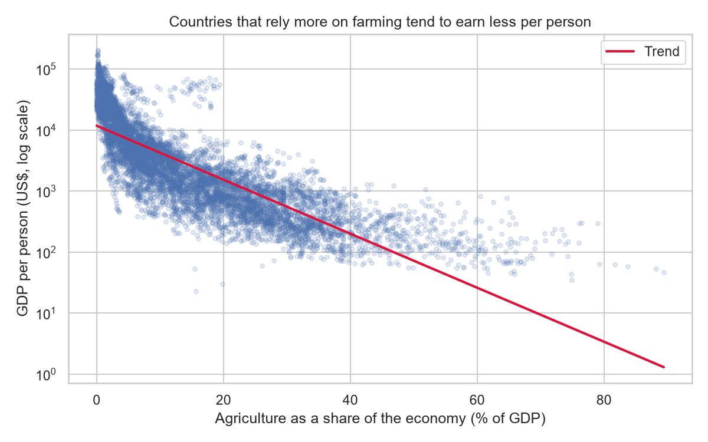
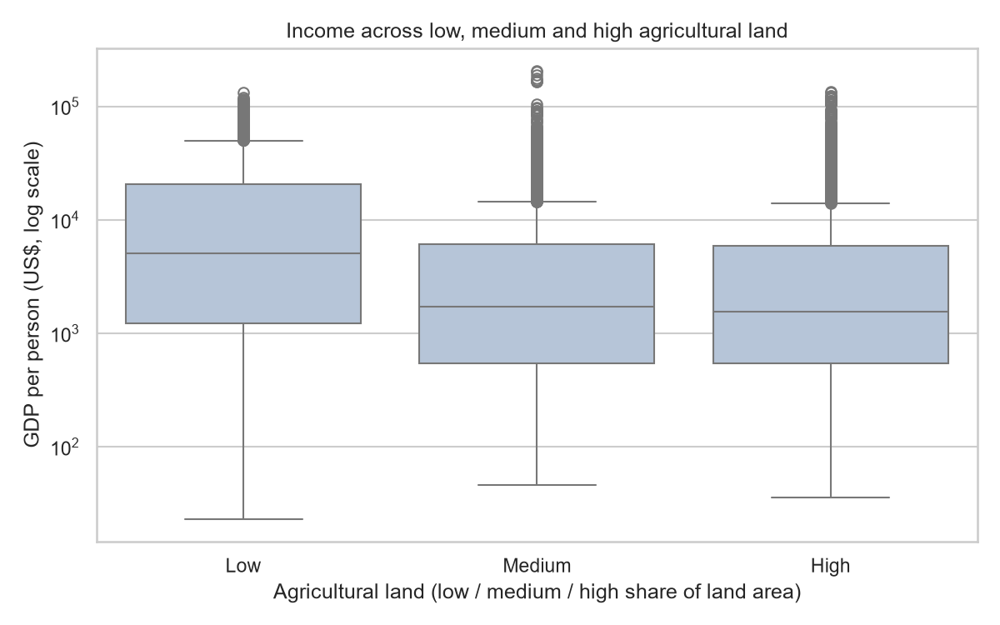
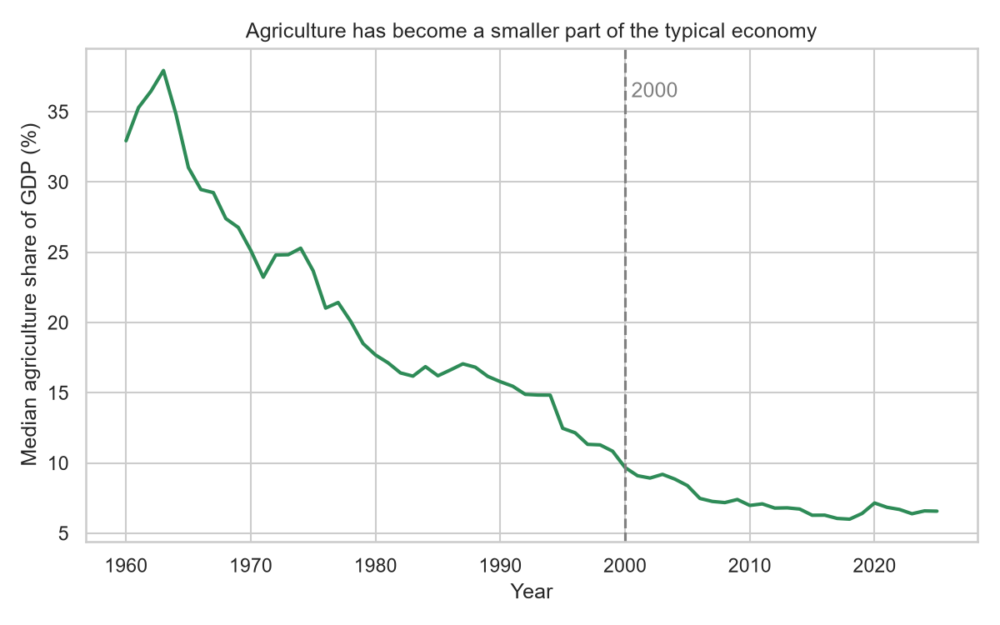

# The clue in the scatterplot: does a farming economy mean a poorer country?

*I started with three World Bank indicators and more than 11,000 country-year records. The strongest pattern was clear. Getting to it and understanding what it does not mean was the real story.*

I expected the hard part of this capstone to be the statistics. Instead, it began with a more basic question: when three datasets do not agree on which countries and years they cover, what should count as a fair comparison?

The question I wanted to explore was simple to state: **Do countries where agriculture makes up more of the economy tend to have lower income per person?**

To investigate, I brought together three World Bank measures covering 1960 to 2025: GDP per capita in current US dollars, agriculture’s share of GDP, and the share of land used for agriculture. They sound like three views of the same thing. They aren’t. One describes income, one describes the structure of the economy, and one describes land use.

## The first surprise was in the spreadsheets

The files arrived in wide format: one row per country, with a separate column for every year. They also included rows such as “World” and “Low income”—useful summaries, but not individual countries—and plenty of blank cells. Countries do not report every indicator in every year.

I reshaped the tables so one row represented one country in one year, filtered out the group summaries, and matched records by country code and year. Then came a choice that changed the size of the analysis.

Starting with the GDP table and using a left join kept all **11,764 GDP records**, even when an agriculture value was missing. An inner join would have kept only country years found in all three tables: **8,510**. I chose not to throw those records away just because one of the other measures was blank. After cleaning implausible zero agriculture-share values, the working dataset held **11,752 records across 212 countries**.

For the main comparison, I still needed all three measures, so I used the **8,465 country-years** with complete values. Missing data was left missing—not quietly changed to zero. A blank means “not reported here,” not “no agriculture.”

## A snapshot before the long view

I also looked at 2020 on its own. Among the reporting countries, the median GDP per capita was about **$6,133**, the median agriculture share was **7.54%**, and the median agricultural-land share was **39.43%**.

Why the median? A few countries have extraordinarily high GDP per person. Those values pull up the average, while the median simply marks the midpoint of the countries we can compare.

That uneven spread shows up in the income data, too. To keep a handful of very high values from dominating the analysis, I compared the **logarithm** of GDP per capita. On a log scale, moving from $100 to $1,000 is treated as the same-sized jump as moving from $1,000 to $10,000: both are a tenfold increase.

## Then the first plot made the pattern hard to miss

Each dot in the scatterplot below is one country in one year. The horizontal axis shows agriculture’s share of GDP; the vertical axis shows GDP per person on a logarithmic scale. The red line summarizes the overall direction.

The Pearson correlation between agriculture’s share of GDP and log GDP per capita was **−0.816**. Correlation ranges from −1 to +1. A number near −1 means two measures tend to move in opposite directions; a number near 0 means little linear relationship.

This was a strong negative association: country-years where agriculture made up more of the economy tended to have lower GDP per person. But the cloud of dots matters as much as the red line. At similar agriculture shares, incomes still vary widely. The pattern describes a tendency, not a rule for every country.

**Figure 1.** Country-years with a larger agriculture share generally sit lower on the income scale.

I checked the same pattern another way. I split country-years into high- and low-agriculture-share groups at the median. In the high-share group, the chance of being above the sample’s median income was **12.2%**. In the low-share group, it was **88.2%**. “High income” here is a relative label from this dataset—not an official World Bank income category.

## But land use told a more complicated story

If agriculture’s economic share was so strongly related to income, would countries that use more land for agriculture show the same pattern?

Not nearly as clearly. The correlation between agricultural land and log GDP per capita was **−0.207**—a much weaker relationship.

The box plot groups country years by low, medium, and high shares of agricultural land. The line inside each box marks the median income; the circles show unusually high values. All three groups contain a broad range of incomes.

The mean log-income values were **3.67** for the low-land group and **3.28** for both the medium and high-land groups. An analysis-of-variance test found differences somewhere among the three groups (F = **250.9**, p < **0.001**), but it does not tell us that land caused those differences. There is no neat staircase where each increase in agricultural land maps to a steady drop in income.

**Figure 2.** The low-land group has a higher median, but the medium- and high-land groups look similar.

That contrast helped sharpen the original question. The *economic weight* of agriculture and the *physical extent* of agricultural land are related ideas, but they are not interchangeable measures.

## Stepping back in time

The third plot follows the median agriculture share among countries reporting data in each year. It starts around one-third of GDP in 1960, reaches a high near 38% early in the series, then trends downward to roughly 6–7% in recent years. The dashed line marks 2000.

**Figure 3.** The median reported agriculture share falls substantially over the series.

I also counted country-years where agriculture made up more than 20% of GDP. Before 2000, that was **45.8% of 4,021** country-years with reported values. From 2000 onward, it was **20.0% of 4,998**. A two-proportion test found a difference between the periods (z = **26.29**, p < **0.001**).

But “before versus after” is not an experiment. Countries were not randomly assigned to a time period, the same countries appear over many years, and the mix of countries with reported values changes. The comparison tells us the records differ—not why the share changed.

## What does a statistical test add?

I used a Welch t-test to compare average log GDP per capita in the high and low agriculture-share groups. The high-share group averaged **2.84** on the log scale—about **$686** when translated back—while the low-share group averaged **3.97**, or about **$9,253**. The measured difference was large (t = **−104.8**, p < **0.001**).

A very small p-value is not the probability that the hypothesis is true, and it does not tell us what caused the gap. There are thousands of records, but they are not thousands of independent experiments: one country contributes observations across many years. That repeated structure can make standard tests sound more certain than they should.

## From analysis to something people can explore

I saved the three plots and built a small Streamlit app around the cleaned dataset. Readers can filter the country-year table by country and year range and inspect the underlying rows. The figures appear as supporting views; they do not redraw when the filters change.

## The answer—and the next question

In this dataset, a larger agriculture share of GDP is strongly associated with lower GDP per person. Agricultural-land share is a much weaker clue, and the median reported agriculture share has declined over time.

That is a finding about association, not proof that agriculture causes low income. Education, health, technology, trade, infrastructure, institutions, conflict, and public policy could shape both income and the structure of an economy. The GDP measure is in current US dollars: it is not adjusted for inflation or differences in the cost of living. Nor does a country-level average show how income is shared among people.

The questions I’m left with are more specific than the one I started with. Do regions show different patterns? What happens if we follow countries individually over time? Which additional measures could help explain the differences?

The biggest lesson was that cleaning data is not a warm up before “real” analysis. Decisions about countries, years, joins, and missing values determine what the evidence can support. The plot may show the clue but understanding how it got there is part of the story.

*Data source: World Bank, World Development Indicators. This project describes associations in the available data; it does not establish causation.*
